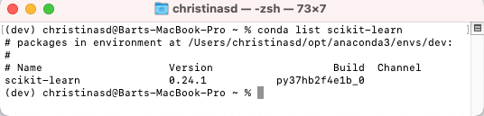
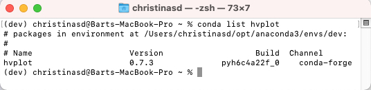

# Unsupervised Crypto Investment Application


This is a machine learning model that groups cryptocurrencies to assemble investment portfolios that are based on the profitability of those cryptocurrencies.

---
## Tools

* [JupyterLab](https://jupyter.org/) - This is a web-based interactive deveopment environment for Jupyter notebooks, code, and data.

---
## Installations

In terminal, with your conda `dev` environment active, run:

* Install scikit-learn

```python
pip install -U scikit-learn
```

To confirm your installation,
```python
conda list scikit-learn
```
It should appear as:


* Install hvPlot

In terminal, with your conda `dev`  environment active, run:

```python
conda install -c pyviz hvplot
```

To confirm your installation,
``` python
conda list hvplot
```
It should appear as:


---
## Contributors
Christina San Diego [LinkedIn](https://www.linkedin.com/in/christinabuted)